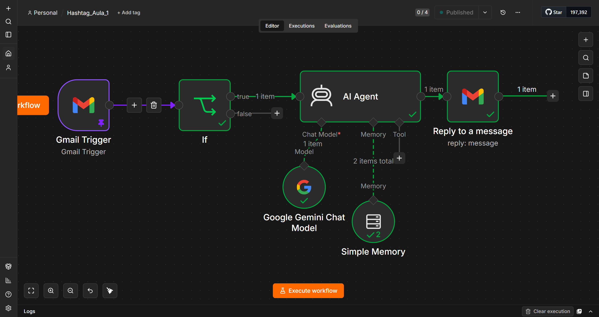

# Imersão Agentes de IA e n8n


Repositório de projetos desenvolvidos durante a **Imersão Agentes de IA e n8n**, da Hashtag Treinamentos. Cada aula gera um projeto independente, documentado e adaptado para um cenário próprio.

Este repositório publica somente implementações autorais, workflows sanitizados, prompts desenvolvidos para os projetos e documentação técnica. Apostilas, gabaritos e materiais didáticos do curso não são reproduzidos aqui.

## Projetos

| Aula | Projeto | Tecnologias | Status |
|---|---|---|---|
| 1 | [Agente de IA para atendimento inicial por e-mail](projetos/projeto-01-agente-email/) | n8n, Gmail, Google Gemini, Docker | Concluído |
| 2 | Em breve | — | Planejado |
| 3 | Em breve | — | Planejado |
| 4 | Em breve | — | Planejado |

## Projeto 1

O primeiro projeto monitora mensagens do Gmail, aplica uma condição de filtragem e utiliza um agente com Google Gemini para produzir respostas de atendimento inicial. A implementação foi adaptada para solicitações relacionadas a web design.

Principais aspectos trabalhados:

- integração entre Gmail, n8n e Google Gemini;
- prompt com limites de autoridade comercial;
- saída em HTML compatível com Gmail;
- separação de contexto por conversa usando `threadId`;
- regras contra instruções maliciosas no conteúdo do e-mail;
- sanitização do workflow antes da publicação.



Acesse a documentação completa em [`projetos/projeto-01-agente-email`](projetos/projeto-01-agente-email/).

## Estrutura

```text
.
├── assets/
│   └── imagens/
├── docs/
│   └── abrir-projeto-n8n-com-docker.md
├── projetos/
│   └── projeto-01-agente-email/
│       ├── prompt/
│       └── workflow/
├── .gitignore
└── README.md
```

## Execução local

Para executar os workflows com Docker Desktop, consulte:

- [Executar e importar workflows do n8n com Docker](docs/abrir-projeto-n8n-com-docker.md)

## Materiais de estudo

<https://drive.google.com/drive/folders/1k5Efky38YB1H9qrVbMEbBb3o1iOBUFVf?usp=drive_link>

## Segurança

Nenhuma credencial, token, chave de API ou mensagem real deve ser versionada. Os workflows publicados são revisados para remover dados de execução, referências de credenciais e informações pessoais.

## Autoria

Projetos desenvolvidos e adaptados por **Liane Ferreira Heidemann** para estudo e portfólio em automação, integração de sistemas e agentes de IA.
